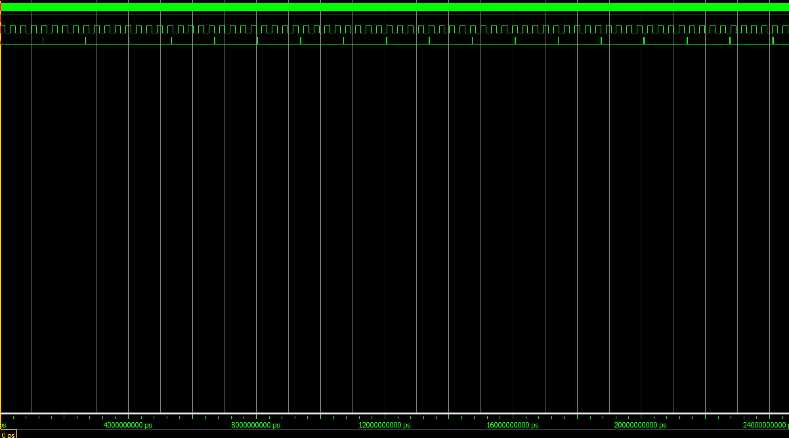
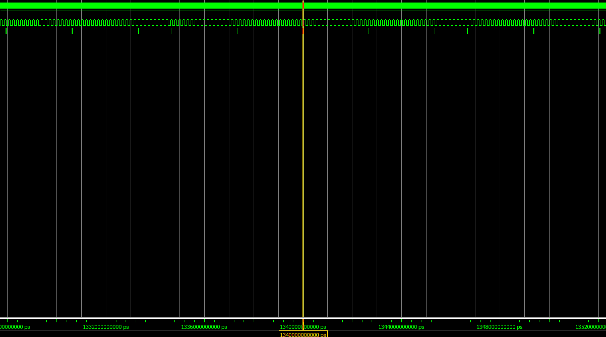
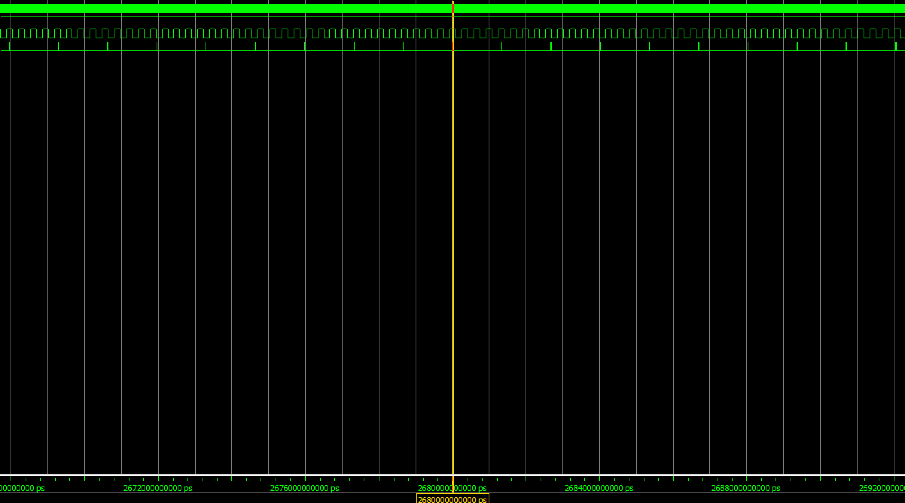

# Alarm With Breathing Led

- [Alarm With Breathing Led](#alarm-with-breathing-led)
  - [项目介绍](#项目介绍)
  - [原理](#原理)
    - [呼吸灯原理](#呼吸灯原理)
    - [蜂鸣器变频原理](#蜂鸣器变频原理)
  - [结果](#结果)
  - [TODO LIST](#todo-list)

## 项目介绍

该项目使用 **FPGA** 设计一个模拟电动车报警器声音的电路，伴随音调的高低 LED 灯由亮变暗又变亮，周而复始。

## 原理

### 呼吸灯原理

我们利用**PWM**技术来调整LED灯的亮度来使其周而复始的变化。该项目的难点即在于：如何平滑地把LED灯控制信号的占空比从小变大，再从大变小。

我们利用us、ms、s之间的进制均为1000这个特点，分别设置微秒、毫秒、秒计数器，``cnt_2``、``cnt_3``、``cnt_4``，以及用于产生微秒计数器数值的变量``cnt_1``。

FPGA开发板的时钟周期为20ns（50MHz），即过50个脉冲后为1us。每隔1us，``cnt_2 = cnt_2 + 1``，当``cnt_2 == 1000``时，``cnt_3 = cnt_3 + 1``，剩下的以此类推。同时，每当高位计数器进位时，低位计数器应当清零，以免浪费资源。

当设置``cnt_2 <= cnt_3``时，输出高电平；``cnt_2 > cnt_3``时，输出低电平，我们就可以获得一个变化占空比的脉冲波。这是因为随着时间推进，ms计数器的值``cnt_3``不停变大，从而改变了占空比。

上述的设置可以保证占空比在1s内从小变大。从大到小的实现只要按位取反控制信号即可。

### 蜂鸣器变频原理

为实现频率的均匀变化，我们可以通过以下方法来进行控制：设置 **28** 位变量``tone``，**7** 位变量``ramp``，其中当``tone[26]``为 **1** 时``ramp`` 为``tone[25:19]``， 为 **0** 时``ramp`` 为``~tone[25:19]``。以及 **15** 位``clkdriver`` ， 由``{2'b01,ramp,6'b000000}``形式组合而成。最后设 **15** 位计数器。工作过程位``tone`` 从零开始计数。``clkdriver`` 控制计数器的计时时长。每当计时器归零就载入新的 ``ramp`` 数值。``ramp`` 值改变影响 ``clkdriver``，进而影响计数器计时时长。``tone`` 和 ``ramp`` 的设计能够保证 ``ramp`` 是一个从 0 到最大值，再从最大值归零的过程。对应了频率的从高到低，再到高的过程。

该方法的周期大约是2.684s，和呼吸灯的周期（2s）严重不符合，于是我们可以改变呼吸灯的周期。一个可行的方法即令``cnt_1``在67时清零，这样我们的“微秒”就变为原来的1.34倍，缩短了和蜂鸣灯周期的差距。

然而这个方法并没有完全消除误差，只要运行的时间足够长，误差一定会大到我们难以接受的程度。

## 结果

## TODO LIST

- [ ] 尝试类似计算闰年的方式减小误差
- [ ] 寻找可改变周期的蜂鸣器变频算法
